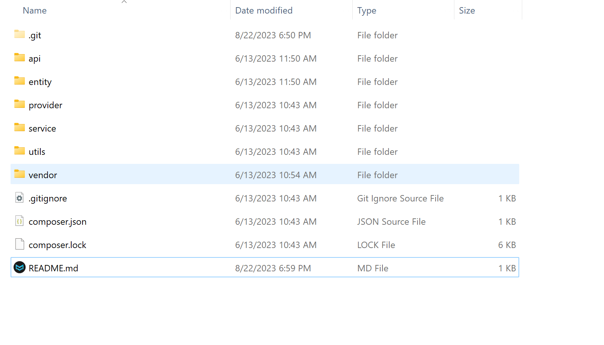
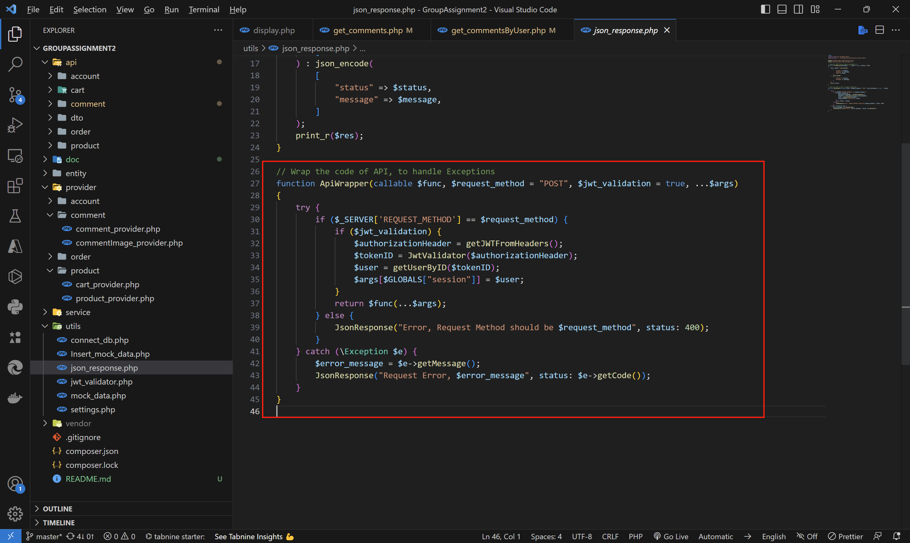
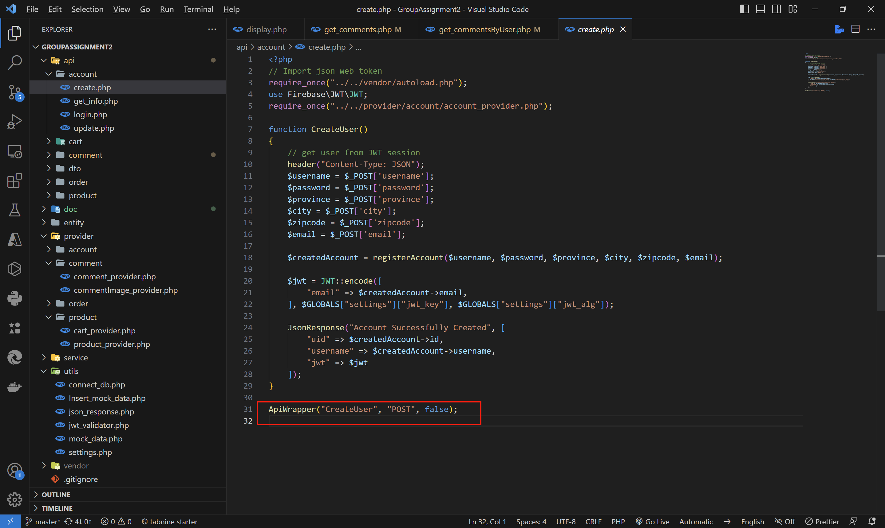

# PROG8185-23S-Sec1-Web-Technologies-Assignment2-PHP-Store-APIs

This is the project for the Assignment2 for Conestoga College PROG8185-23S-Sec1-Web Technologies. It's build by Siyu Liu, Eugenio Contreras Lizana, Asad Ullah Ashraf and Akshat Arora. Which is used with the React App of Assignment 1. This PHP Store API project consists of 5 main sections, including account, cart, comment, order and product.

## Project Structure

## "Decorator" of PHP function

PHP doesn't support decorator syntax directly, to handler every api's function globally, The project using a function named ApiWrapper to execute the function inside, <u>the function's param should use callable before, it means this param is a function</u>.

The params of the inside function, use <u>...$args</u> to replace

The example of this "decorator" usage.

